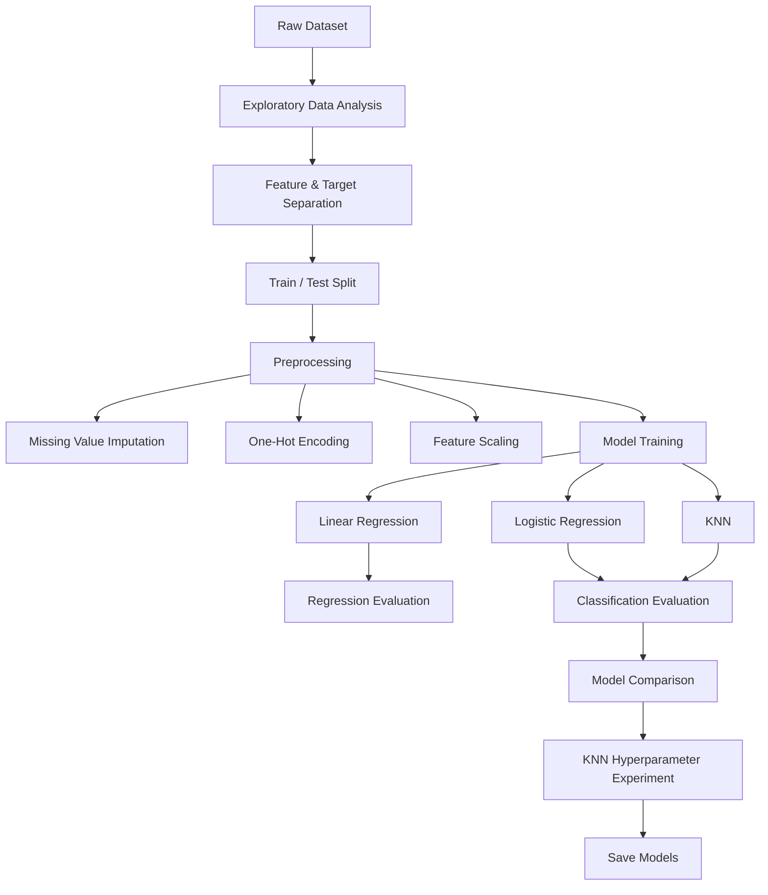

# House Price Prediction & Classification

Machine Learning project using the Ames Housing dataset to predict house prices and classify properties into Affordable and Expensive categories.

## Problem

House prices depend on many factors such as location, size, quality, year built, garage features, and other property characteristics.

This project uses Machine Learning to:

* Predict the exact `SalePrice` of a house.
* Classify houses as `Affordable` or `Expensive`.

## Dataset

The project uses the Ames Housing Dataset from the Kaggle House Prices competition.
[Link](https://www.kaggle.com/competitions/house-prices-advanced-regression-techniques/data)

The dataset contains 79 explanatory features describing residential properties in Ames, Iowa.

## Models

### Regression

**Linear Regression**

Used to predict the continuous house `SalePrice`.

Evaluation metrics:

* MAE
* RMSE
* R²

### Classification

**Logistic Regression**

**K-Nearest Neighbors (KNN)**

Both models classify houses into:

* `0` → Affordable
* `1` → Expensive

The median house price is used as the classification threshold.

## Workflow



## Data Preprocessing

The dataset contains both numerical and categorical features.

### Numerical Features

* Missing values → Median Imputation
* Feature scaling → `StandardScaler`

### Categorical Features

* Missing values → Most-Frequent Imputation
* Encoding → `OneHotEncoder`

`Pipeline` and `ColumnTransformer` are used to keep preprocessing and modeling together.

## Evaluation

### Regression

| Metric | Purpose                           |
| ------ | --------------------------------- |
| MAE    | Average absolute prediction error |
| RMSE   | Penalizes larger errors           |
| R²     | Measures explained variance       |

### Classification

| Metric           | Purpose                              |
| ---------------- | ------------------------------------ |
| Accuracy         | Overall prediction accuracy          |
| Precision        | Correct positive predictions         |
| Recall           | Ability to identify positive cases   |
| F1 Score         | Balance between precision and recall |
| Confusion Matrix | Detailed classification results      |

## KNN Experiment

Different values of `k` are tested:

```text
1, 3, 5, 7, 9, 11, 15
```

The models are compared using F1 Score to study the effect of the number of neighbors.

## Project Structure

```text
house-price-ml/
│
├── data/
│   └── train.csv
│   
├── notebooks/
│   └── house_price_ml.ipynb
│
├── models/
│   ├── linear_regression_full_features.joblib
│   ├── logistic_regression_full_features.joblib
│   └── knn_full_features.joblib
│
├── README.md
├── requirements.txt
└── .gitignore
```

## Installation

```bash
git clone https://github.com/YOUR_USERNAME/house-price-ml.git
cd house-price-ml

python -m venv .venv
```

Activate the environment on Windows:

```bash
.venv\Scripts\activate
```

Install dependencies:

```bash
pip install -r requirements.txt
```

## Run

Start Jupyter Notebook:

```bash
jupyter notebook
```

Open:

```text
notebooks/house_price_ml.ipynb
```

Run the notebook cells in order.

## Saved Models

The trained pipelines are saved using Joblib:

```text
models/
├── linear_regression_full_features.joblib
├── logistic_regression_full_features.joblib
└── knn_full_features.joblib
```

The complete pipelines include both preprocessing and trained models.

## Key Learning

This project demonstrates a complete Machine Learning workflow:

```text
Understand
    ↓
Explore
    ↓
Clean
    ↓
Transform
    ↓
Train
    ↓
Predict
    ↓
Evaluate
    ↓
Compare
    ↓
Save
```
